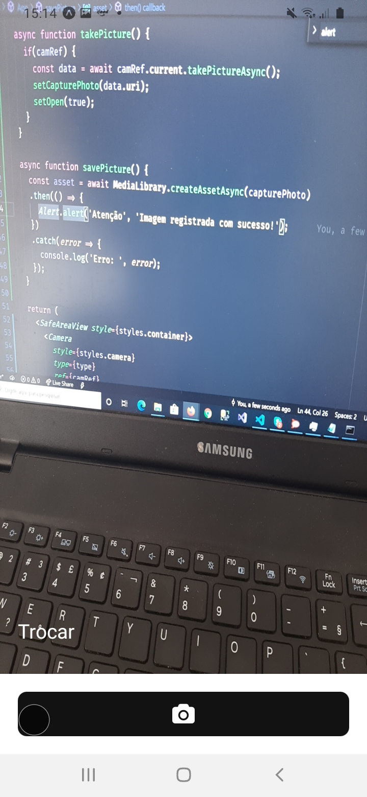
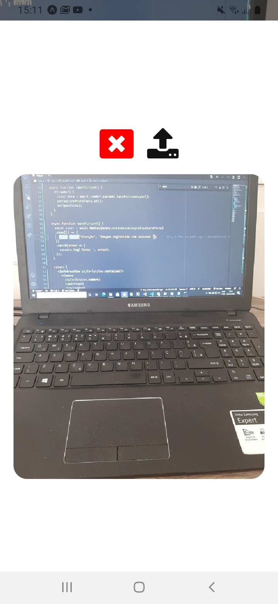

# expo-camera-example
Projeto criado em React Native para testar a Camera presente no pacote do Expo.

### Bibliotecas utilizadas
• expo

• expo-camera

• expo-permissions

• expo-media-library

### Para testar

### mobile
react-native run-android

### Utilização
As cameras frontal e traseira podem ser alternadas ao clicar no botão "Trocar". Para tirar a foto, basta clicar no botão com ícone da camera e aguardar o preview da foto aparecer na tela (screenshot01). Na tela aberta (screenshot02), pode descartar a foto (botão do X) ou armazenar na galeria (botão Salvar).

### screenshots

